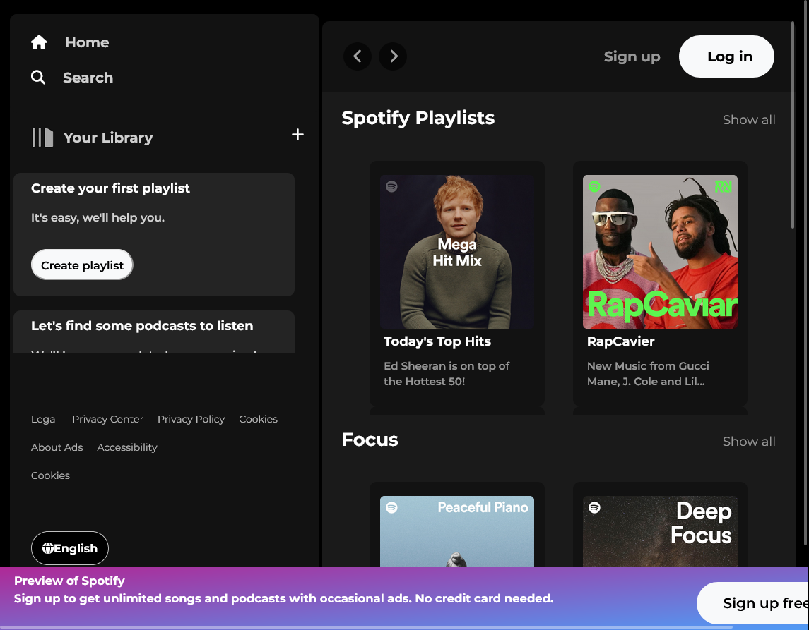

# Spotify Clone

## Overview

Spotify Clone is a front-end replica of the Spotify web player, created using pure HTML, CSS, and JavaScript. The project features a visual and interactive layout similar to Spotify’s interface, with sign-up and login pages.



## Features

- **User Interface:** Designed with HTML and CSS to closely mimic Spotify’s sleek and modern look.
- **Sign-Up and Login Pages:** Functional and styled pages for user registration and login, although authentication functionality is not implemented.
- **Dynamic Content:** JavaScript handles interactive elements on the front page for a more engaging user experience.
- **Responsive Design:** Ensures compatibility across various devices and screen sizes.

## How to Use

1. **Navigate:** Open the `index.html` file in your web browser to view the front page.
2. **Sign-Up/Login:** Use the sign-up and login pages to simulate user interaction.

## Installation

1. Clone the repository:
   ```bash
   git clone https://github.com/your-username/spotify-clone.git
